# 简单的中文文本情感分类

一个用 PyTorch 实现的中文文本情感分类网络，代码较简单，功能较丰富，包含了多种模型 baseline。

## 环境需求

* python == 3.6
* torch == 1.1.0
* cuda == 10.0.130
* cudnn == 7.5.1.10
* Intel(R) Xeon(R) CPU E5-2620 v4 @ 2.10GHz
* NVIDIA TITAN Xp

其余的见 `requirements.txt`

## 使用方法

先预处理，`./run_preprocess_word2vec.sh` 或 `./run_preprocess_elmo.sh 3`（3 是 gpu 编号）

然后运行 `python3 main.py --config_path config_cnn.json`

## 预处理

将所给文本的每个词转换成预训练模型的词向量后存到文件里。我分别尝试了这两种 embedding：

* ELMo 中文预训练模型，1024d（https://github.com/HIT-SCIR/ELMoForManyLangs）
* Chinese-Word-Vectors，300d（https://github.com/Embedding/Chinese-Word-Vectors）

请自行下载相应的模型文件到 `data/word2vec/` 或 `data/zhs.model` 文件夹下。

具体细节见 `preprocess.py` 文件，若想使用自己的数据集，修改该文件即可。

## 实现的模型

### MLP (2 layer)

Linear + ReLU + Dropout + Linear + Softmax

### CNN (1 layer) + MLP (2 layer)

Conv1d + ReLU + Dropout + MaxPool1d + Linear + ReLU + Dropout + Linear + Softmax

见这篇 paper [https://www.aclweb.org/anthology/D14-1181](https://www.aclweb.org/anthology/D14-1181)

[1] Kim, Y. (2014). Convolutional Neural Networks for Sentence Classification. Proceedings of the 2014 Conference on Empirical Methods in Natural Language Processing (EMNLP 2014), 1746–1751.

### RNN (1 layer) + Self-Attention + MLP (2 layer)

RNN (GRU or LSTM or bi-GRU or bi-LSTM) + Self-Attention + Linear + ReLU + Dropout + Linear + Softmax

Self-Attention 见这篇 paper [https://arxiv.org/pdf/1703.03130.pdf](https://arxiv.org/pdf/1703.03130.pdf)

[2] Zhouhan Lin, Minwei Feng, Cicero Nogueira dos Santos, Mo Yu, Bing Xiang, Bowen Zhou, and Yoshua Bengio. 2017. A structured self-attentive sentence embedding. In Proceedings of International Conference on Learning Representations.

## 某些参数的解释

* `seed`：`20000125` (保证结果可复现)
* `gpu`：`false` (使用 cpu)，`true` (使用 nvidia 系 gpu，推荐)
* `output_path`：运行模型会将日志文件、TensorBoard 文件、配置文件生成到该目录下
* `loss`：`l1` (L1Loss) ，`mse` (MSELoss)，`cross_entropy` (CrossEntropyLoss，推荐)
* `optimizer`：`sgd`，`adagrad` (Adagrad 自带了 L2 regularization，推荐)
* `embedding_size`：`1024` (ELMo)，`300` (Chinese-Word-Vectors，较小，推荐)
* `type`：`mlp`，`cnn`，`rnn`

　　具体见 `config_mlp.json`、`config_cnn.json`、`config_rnn.json` 这些文件。

## 数据集

　　数据集用的是 THU 计算机系《人工智能导论》作业三的数据集，在这里我不方便公开数据集及其介绍。大概的介绍一下就是，中文新闻，8 种情感分类。

　　这个数据集我必须要说一下，数据集比较小，网民标注数据不太准确，训练集和测试集分布不太一样（训练集是 2012 年 1 月至 2 月 发布的 2,342 篇新闻文章，测试集是 2012 年 3 月至 4 月发布的 2,228 篇新闻文章），所以某些模型可能达不到预期的效果。

　　我从所给训练集数据取出后 1/10 作为 dev 数据集，每训一个 epoch 都测试一次 dev 数据集，然后取一个准确率最高的那个 epoch 的模型作为最终测试的模型。

## 实验结果

　　先放最好的结果（总共训练了 300 epoch，取 dev 数据集准确率最高的那个 epoch 来对 test 数据集进行测试得到的下表，总用时指的是训完 300 个 epoch 后的用时）：

|   模型   | Accuracy(%) | F1(%) | CORR | 总用时 |                            参数                            |
| :------: | :---------: | :---------: | :--: | :--------------: | :--------------------------------------------------------: |
|    MLP   |    59.4     |    21.5     | 0.28 |      7m44s       |     [save/mlp_1/config.json](./save/mlp_1/config.json)     |
|    CNN   |    62.4     |    30.2     | 0.41 |      9m56s       |     [save/cnn_5/config.json](./save/cnn_5/config.json)     |
|    bi-LSTM  |    58.1     |    30.8     | 0.27 |      37m47s      | [save/bi-lstm_1/config.json](./save/bi-lstm_1/config.json) |
|    bi-GRU  |    57.3     |    26.3     | 0.31 |      34m47s      |  [save/bi-gru_1/config.json](./save/bi-gru_1/config.json)  |
|    LSTM   |    55.56    |    25.3     | 0.26 |      21m44s      |    [save/lstm_1/config.json](./save/lstm_1/config.json)    |
|    GRU    |    51.3     |    25.3     | 0.26 |      20m41s      |     [save/gru_1/config.json](./save/gru_1/config.json)     |
| MLP-ELMo |    58.1     |    21.9     | 0.21 |      18m26s      |     [save/mlp_3/config.json](./save/mlp_3/config.json)     |
| CNN-ELMo |    59.8     |    30.1     | 0.34 |      14m23s      |     [save/cnn_6/config.json](./save/cnn_6/config.json)     |

　　下图为 dev Accuracy


　　下图为 dev F1 (macro)

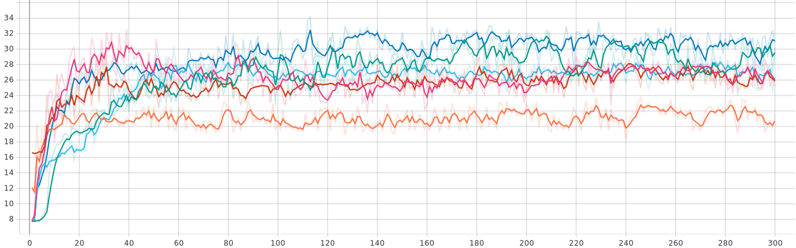

　　下图为 dev CORR

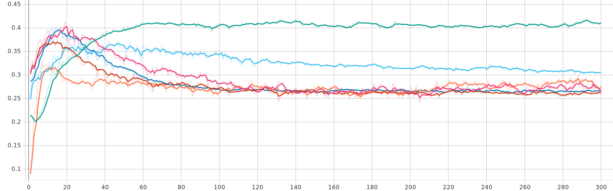

　　下图为 train Accuracy

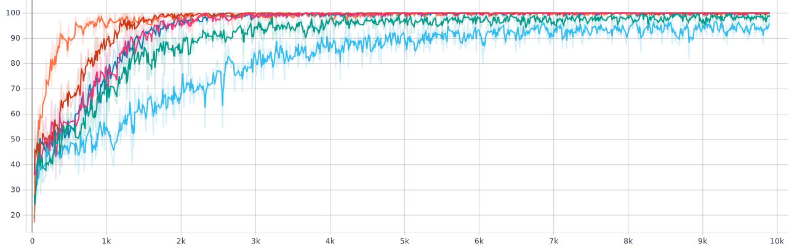

　　若想查看更多图表请运行以下命令

```
$ tensorboard --logdir MLP:save/mlp_1/runs/,\
CNN:save/cnn_5/runs/,\
bi-LSTM:save/bi-lstm_1/runs/,\
bi-GRU:save/bi-gru_1/runs/,\
LSTM:save/lstm_1/runs/,\
GRU:save/gru_1/runs/,\
MLP-ELMo:save/mlp_3/runs/,\
CNN-ELMo:save/cnn_6/runs/
```

## 模型与参数比较

　　由上图来看，MLP 收敛最快，最早进入过拟合，测试结果一般；RNN 系的模型收敛速度较快（bi-GRU除外），测试结果不是很好；CNN 的模型收敛较慢，特别稳定，测试结果特别好。

　　MLP 作为一个入门模型，效果却非常不错，甚至吊打 RNN 系，这其实挺迷的，我能想到的原因只有我参数没找对或者数据集有毒。而 CNN 我曾经尝试过用 2 层卷积层，但效果不如 1 层的，所以后来就放弃了。

　　优化器基本上都是用的 `adagrad`，`sgd` 根据调参结果基本不会再用了（收敛太慢了）。

```json
"optimizer": "adagrad",
"lr": 0.01,
"lr_decay": 0,
"weight_decay": 0.0001,
```

　　`ELMo` 的词向量经测试效果不太好，感觉应该是 pre-trained model 训的数据集和我们这个数据集分布差的有点多，然后我又没将 pre-trained model 接到我网络前面继续 fine tune 才导致的效果差？比较 [save/cnn_5](./save/cnn_5/config.json)（Chinese-Word-Vectors，橙色）和  [save/cnn_6](./save/cnn_6/config.json)（ELMo，蓝色）的图能看出在这个数据集上这个 ELMo 效果确实太好。

|        dev Accuracy        |        train Accuracy        |
| :------------------------: | :--------------------------: |
| 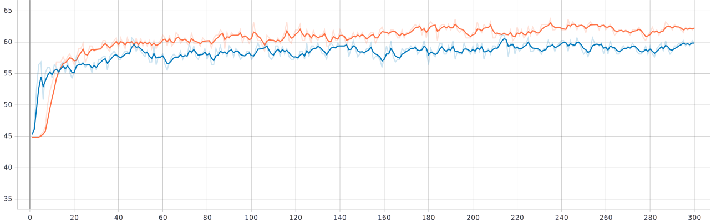 | 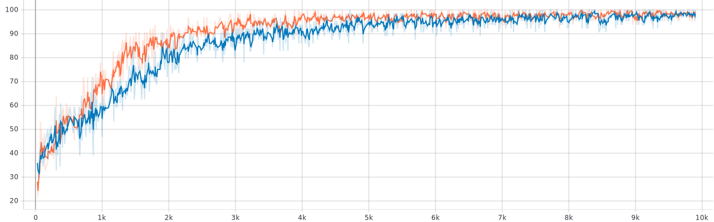 |

　　`Dropout` 是为了防止过拟合，比较 [save/cnn_1](./save/cnn_1/config.json)（dropout = 0.5，橙色）和  [save/cnn_4](./save/cnn_4/config.json)（dropout = 0.9，蓝色）的图能明显看出，当 dropout 越大，收敛越慢，但准确率更高，防止过拟合能力越强（毕竟解耦能力强）。

|        dev Accuracy        |        train Accuracy        |
| :------------------------: | :--------------------------: |
| 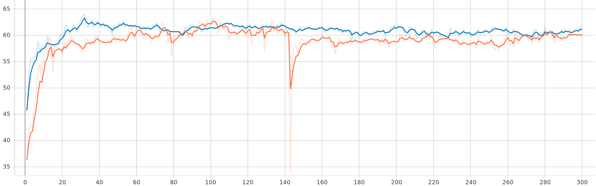 | 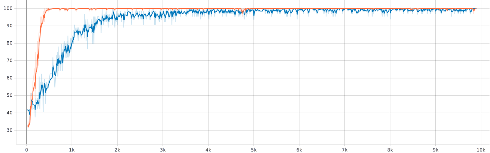 |

　　`Batch Normalization` 可以防止过拟合，比较卷积层里无 BN 无 Drouput 的 CNN  [save/cnn_8](./save/cnn_8/config.json)（蓝色）和卷积层里有 BN 无 Drouput 的 CNN  [save/cnn_7](./save/cnn_7/config.json)（Conv1d + BatchNorm1D + ReLU + MaxPool1d + Linear + ReLU + Dropout + Linear + Softmax，橙色）可以非常明显的看出。

|        dev Accuracy        |        train Accuracy        |
| :------------------------: | :--------------------------: |
| 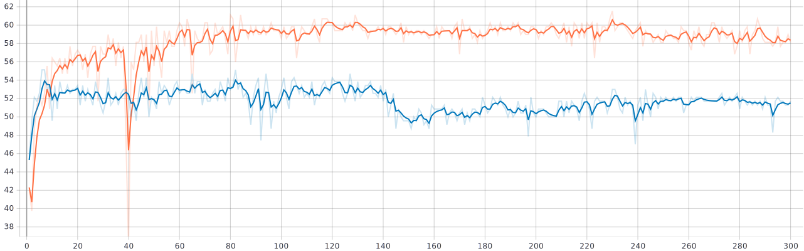 | 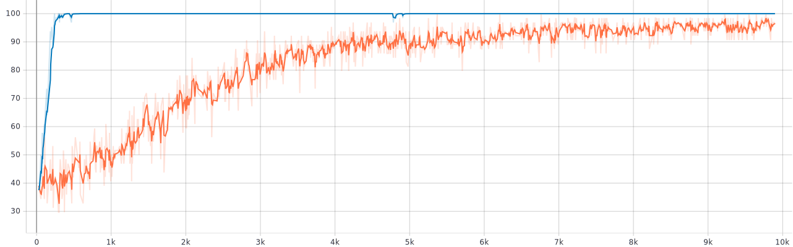 |

　　`Self-Attention` 给 Loss 加了个惩罚项（penalization term），我比较了其在总 Loss 中系数不同的效果， [save/bi-lstm_1](./save/bi-lstm_1/config.json)（系数 = 1，橙色）和  [save/bi-lstm_2](./save/bi-lstm_2/config.json)（系数 = 0.3，蓝色），发现其对收敛速度有影响，高一点的话收敛会快很多，不过准确率有下降（感觉还是自己没细调的原因）。

|        dev Accuracy        |        train Accuracy        |
| :------------------------: | :--------------------------: |
| 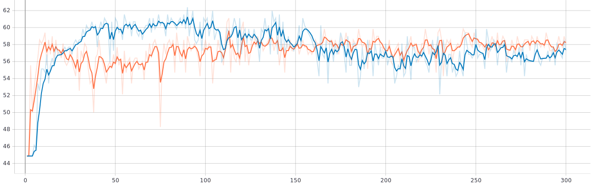 | 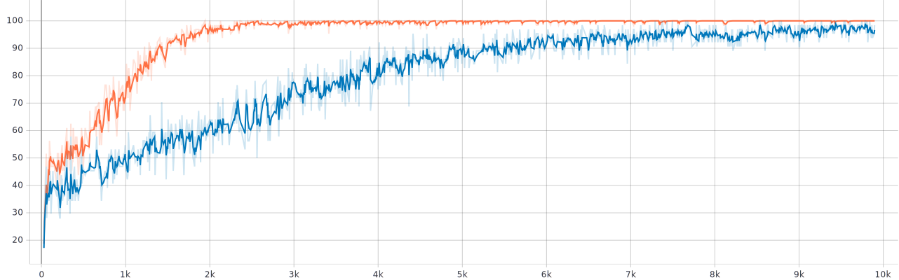 |

　　参数实在太多，真的不想再调了。

## 问题思考

##### 1） 实验训练什么时候停止是最合适的？简要陈述你的实现方式，并试分析固定迭代次数与通过验证集调整等方法的优缺点。

　　两种方式，我采用的是第 2 种：

1. 设置一个阈值 θ（和累计次数 λ），当历史准确率最大值减去当前准确率最大值大于 θ 时（或累积大于 λ 次时），则停止。
2. 估计过拟合前的位置（也能用方法 1 来估计），设置固定的迭代次数。

　　固定迭代次数的优点是，在机器配置较好（或模型较简单）的情况下，可以跑多一点 epoch，从而可以非常直观的比较不同模型的数据（曲线）来判断模型的优劣；缺点是花费时间较长。

　　通过验证集调整的方式的优点是，在机器配置较低（或模型较复杂）、ddl 时间不足或想快速选择模型时，能有效提高时间效率；缺点是不太能直观地比较不同模型的特点。

##### 2）实验参数的初始化是怎么做的？不同的方法适合哪些地方？（现有的初始化方法为零均值初始化，高斯分布初始化，正交初始化等）

　　我的代码里，除了 Self-Attention 的两个矩阵用的是标准正态分布外（还试过 U(-sqrt(1/u), sqrt(1/u)) 和 U(-sqrt(1/da), sqrt(1/da)) 但效果差不多），其余所有参数都是用 PyTorch 的默认初始化。

　　一般用均匀或正态的零均值分布来初始化线性层、卷积层的权重矩阵和偏置，根据系数的不同，又分为 xavier 的均匀、正态分布，kaiming 的均匀、正态分布。xavier 的分布适用于激活函数是 tanh 的初始化，不太适用于 ReLU。而 kaming 则非常适用于带 ReLU 激活函数的地方。PyTorch 里的线性层的初始化为均匀分布 U(-sqrt(1/in), sqrt(1/in))（a = sqrt(5) 的 kaiming 分布，in 为矩阵的第二维大小）。

　　而正交初始化适用于 RNN 中参数的初始化，用以解决递归网络下的梯度消失、梯度爆炸问题。

##### 3）过拟合是深度学习常见的问题，有什么方法可以方式训练过程陷入过拟合。

Batch Normalization：

　　BN 能提高模型的泛化能力，有效防止过拟合，减少参数初始化的影响。其原因在于 BN 将数据分布拉到了一个标准正态分布，减小了分布的 internal covariate shift ，一定程度上避免了梯度爆炸，而中心部分也有很大的梯度值，一定程度上避免了梯度消失。但若学习率设置不好，模型可能收敛得很慢。

Dropout：

　　Dropout 是提高模型泛化能力的万金油，通过抑制一些神经元的输出以及放大其余神经元的输出来减小不同神经元的耦合性。加就完事了。

　　但需要注意的是，加了 BN 再加 Dropout 效果可能很不好。

##### 4）试分析 CNN，RNN，全连接神经网络（MLP）三者的优缺点。

|      |                             MLP                              |                             CNN                              |                             RNN                              |
| :--: | :----------------------------------------------------------: | :----------------------------------------------------------: | :----------------------------------------------------------: |
| 优点 |      结构简单，易理解，可解释，学习全局信息，能矩阵加速      | 结构简单，可解释，学习局部信息，在局部特征明显时优势很大，能矩阵加速，超快 |       结构简单，可解释，输入长度可变，有时序性，可记忆       |
| 缺点 | 输入大小固定，参数规模较小时学习能力弱，参数规模大时内存开不下 | 输入大小固定，比较浅时学习能力有限，不能获取全局信息，往往需要在后面加个 MLP | 容易梯度消失和梯度爆炸，总体不是矩阵乘法，无法矩阵加速（单个元内部的矩阵乘法除外），较慢，往往后面也要加个 MLP |

## 心得体会

　　我在上学期的《人工神经网络》中学过相关知识，而且在作业里也手写过 MLP、CNN、RNN 的源码级别的实现，因此做本次作业还是比较轻松的（更何况直接调库就好了）。不过这是我第一次从零开始用 PyTorch 写出这些模型，所以我还是学到了很多 PyTorch 的知识的。同时我还为室友们和其他同学们讲解了 MLP、CNN、RNN 的概念和原理，巩固了我在这方面的知识。最后感谢一下助教在微信群里的答疑。

　　在这里提一个小建议，总的来说，本次作业综合了神经网络里的三个基本模型还是不错的，但唯一遗憾的是数据集可能不是那么的优秀，从而导致有些同学（包括我）怀疑自己模型、参数有问题，认为人工智能十分玄学，甚至对这门学科感到厌倦。希望在明年能改进这个问题吧。